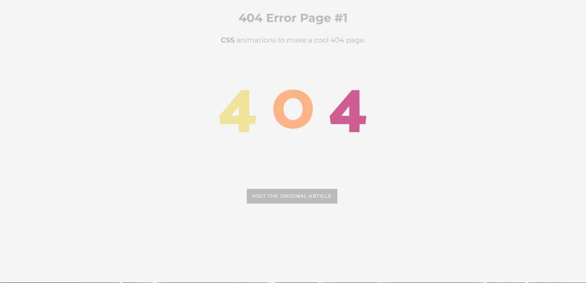
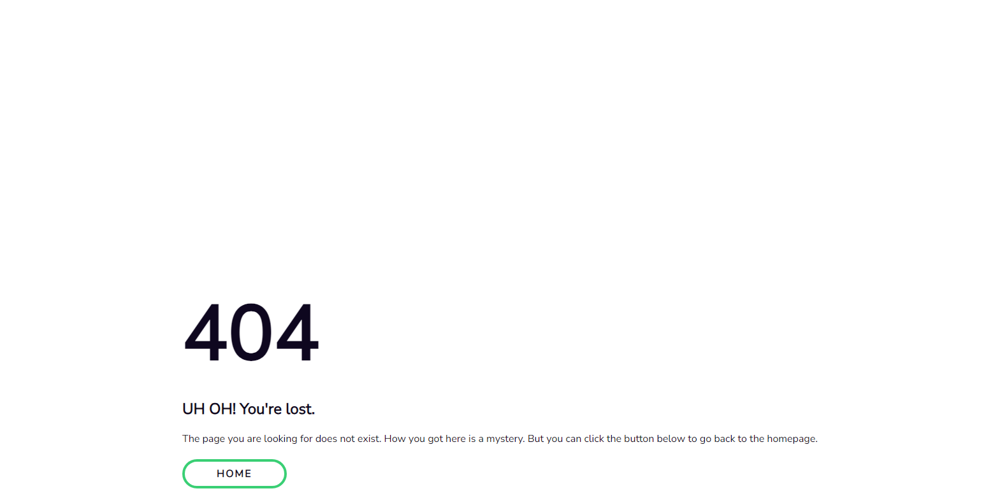
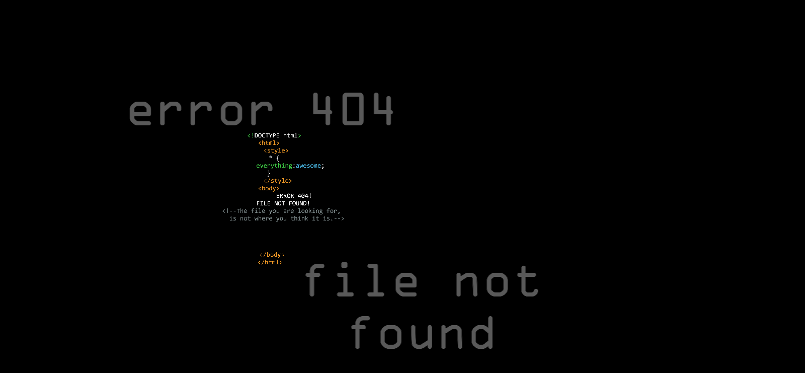
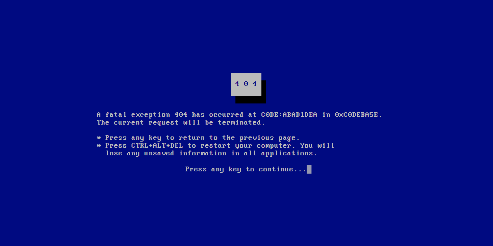
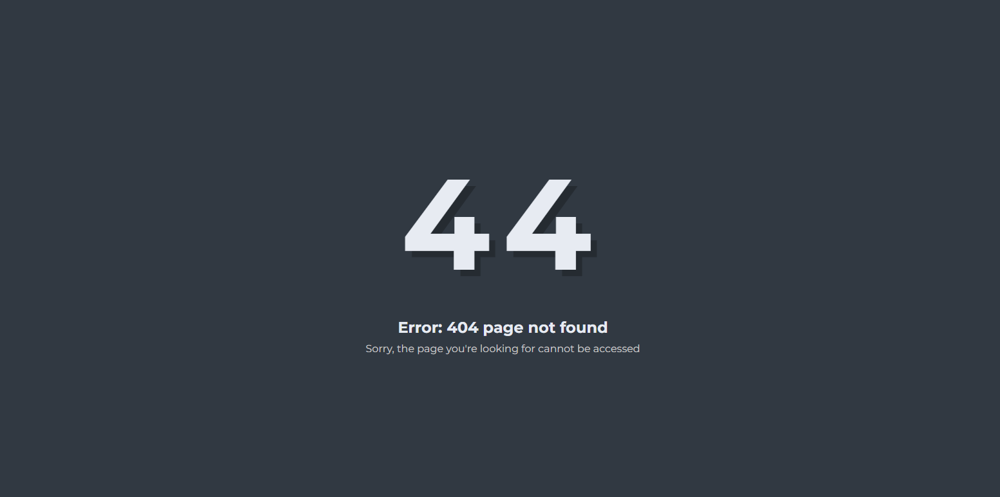
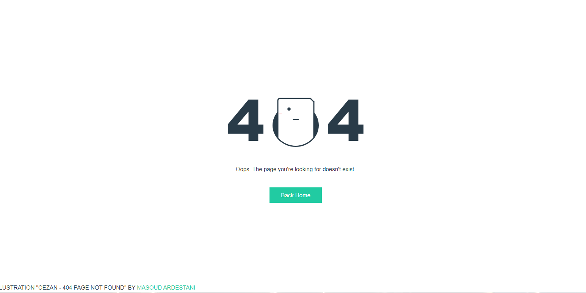

# 馃捇 Paginas de Errores (ERROR PAGES)

Bienvenido a la **Erros Page** Ejemplo de paginas de errores, para que puedas usarla a tu antojo

## 馃専 Descripci贸n

Este sistema est谩 desarrollado utilizando las siguientes tecnolog铆as:
- **Versi贸n AppWeb**: V 1.0.0
- **Fecha**: Septiembre 18, 2024
- **Lenguaje de programaci贸n**: HTML, CSS, JS

## 馃摓 Contacto

Si est谩s interesado en adquirir el sistema o tienes alguna pregunta, no dudes en contactarme:

- **Derechos de autor**: Copyright 漏 2024 Carlos Pc's Soluciones / All rights reserved
- **Desarrollador Web y Lider de Proyecto**: Carlos Flores
- **WhatsApp**: +584123330319 / +584262181998
- **Email**: cflores@carlospcssoluciones.com.ve
- **Github**: https://github.com/encrypthdd/error-pages.git

### 馃攳 Panel de Control

